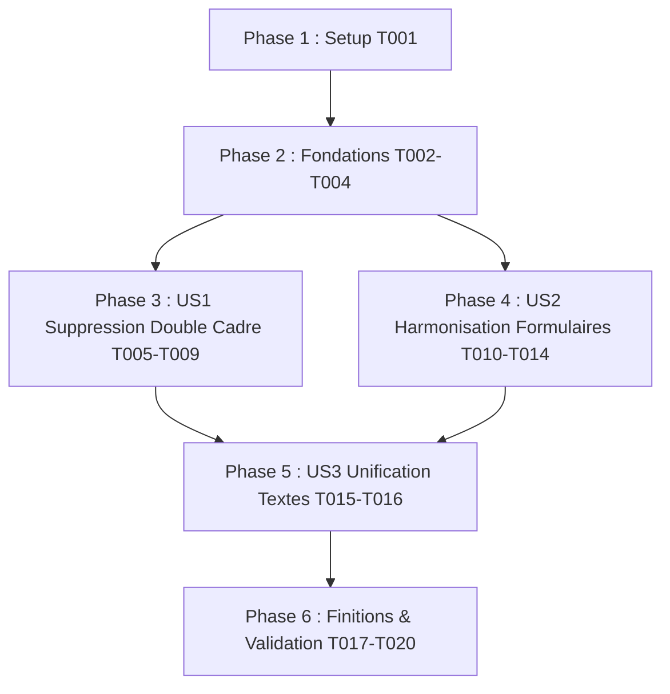

# Tâches d'implémentation : 005-ui-and-frame-refinement

## Phase 1 : Configuration (Setup)

**Objectif** : Vérification des styles Tailwind et des tokens graphiques

- [X] T001 [P] Configurer les variables et tokens Tailwind `@theme` pour les cadres et contrôles M3 dans `frontend/src/styles.scss`

---

## Phase 2 : Fondations & Services (Priorité : P0)

**Objectif** : Mettre en place les contrats de données stricts et le service d'export DOM autonome.

**Test indépendant** : Vérifier que les modèles et services compilent et que les tests unitaires isolés s'exécutent.

### Implémentation des Fondations

- [X] T002 [P] Mettre à jour `FrameStyleType` dans `frontend/src/app/core/models/live-qr.model.ts` pour inclure `'none' | 'simple-bottom' | 'badge-bottom' | 'rounded-border'` (Catégorie 1)
- [X] T003 [P] Définir l'interface générique `VisualOption<T>` dans `frontend/src/app/core/models/live-qr.model.ts` pour les composants de choix visuels (Catégorie 1)
- [X] T004 Mettre à jour l'état initial par défaut de `QrSimulatorState` dans `frontend/src/app/features/home/data-access/qr-simulator.service.ts` avec `style: 'simple-bottom'` et `text: 'SCAN ME'` (Catégorie 2)

**Point de contrôle** : Les fondations de types sont prêtes - l'implémentation des User Stories peut commencer

---

## Phase 3 : User Story 1 - Rendu Pur du Cadre dans le Simulateur (Suppression du "Double Cadre") (Priorité : P0)

**Objectif** : Éliminer la boîte superflue du mockup (`bg-inverse-surface`) et faire du cadre sélectionné le conteneur direct et unique du QR code, exactement comme sur les visuels de référence.

**Test indépendant** : Sélectionner un cadre (« simple-bottom », « badge-bottom », « rounded-border » ou « none ») et vérifier visuellement l'absence totale de double cadre ou de boîte englobante parasite.

### Tests de la User Story 1 (TDD)

- [X] T005 [P] [US1] Créer les tests unitaires pour le rendu des cadres dans `frontend/src/app/features/home/ui/simulator-section/simulator-section.component.spec.ts` (Catégorie 2)

### Implémentation pour la User Story 1

- [X] T006 [P] [US1] Refondre le conteneur d'aperçu droit dans `frontend/src/app/features/home/ui/simulator-section/simulator-section.component.html` en retirant la boîte mockup sombre `bg-inverse-surface` et en exposant `#live-qr-framed-container`
- [X] T007 [US1] Implémenter le gabarit de cadre « Bandeau Inférieur » (Image 2) dans `simulator-section.component.html` avec bordure continue et bloc inférieur plein affichant le texte en majuscules
- [X] T008 [US1] Implémenter le gabarit de cadre « Badge Flottant » (Image 3) avec pilule arrondie et flèche callout triangulaire orientée vers le QR code dans `simulator-section.component.html`
- [X] T009 [US1] Mettre à jour `downloadSvg` dans `frontend/src/app/features/home/data-access/qr-simulator.service.ts` pour capturer fidèlement le conteneur cadré via `dom-export.service.ts` lorsque le cadre n'est pas `none`

**Point de contrôle** : À ce stade, le QR code s'affiche dans son cadre épuré sans effet de boîte dans une boîte.

---

## Phase 4 : User Story 2 - Harmonisation Visuelle des Formulaires (DA M3 / Tailwind) (Priorité : P1)

**Objectif** : Aligner l'ensemble des 5 formulaires de personnalisation sur la direction artistique luxueuse du site (cartes interactives, segmented controls, swatches rapides, drag & drop).

**Test indépendant** : Naviguer dans les onglets Cadre, Forme, Couleurs, Logo et Wi-Fi et valider l'ergonomie moderne et soignée des composants.

### Implémentation pour la User Story 2

- [X] T010 [P] [US2] Refondre `frame-form.component.html` et `frame-form.component.ts` avec une grille de cartes d'options graphiques sélectionnables (icône, étiquette, feedback visuel) au lieu d'un `<select>`
- [X] T011 [P] [US2] Refondre `styling-form.component.html` et `styling-form.component.ts` avec des cartes d'aperçu miniature des formes de points (arrondi, dots, classy, square)
- [X] T012 [P] [US2] Refondre `colors-form.component.html` et `colors-form.component.ts` avec segmented control moderne (Uni / Dégradé), swatches de couleurs rapides luxe et sélecteur de couleurs
- [X] T013 [P] [US2] Refondre `logo-form.component.html` et `logo-form.component.ts` avec une zone drag-and-drop soignée, indicateur visuel de format et bouton de suppression stylisé
- [X] T014 [P] [US2] Refondre `wifi-form.component.html` et `wifi-form.component.ts` avec segmented buttons pour le chiffrement (`WPA`, `WEP`, `Aucun`) et champs avec icônes intégrées

**Point de contrôle** : Les 5 formulaires s'intègrent parfaitement dans la DA haut de gamme du site.

---

## Phase 5 : User Story 3 - Unification du Flux de Saisie et Cohérence des Textes (Priorité : P2)

**Objectif** : Éliminer les redondances textuelles en unifiant le champ de slogan inférieur avec le texte du cadre.

**Test indépendant** : Modifier le texte d'accompagnement dans l'onglet Cadre et vérifier la mise à jour temps réel sur le bandeau/badge sans entrée concurrente sur l'écran.

### Implémentation pour la User Story 3

- [X] T015 [US3] Supprimer l'ancien champ redondant "Texte du bandeau inférieur" de `frontend/src/app/features/home/ui/simulator-section/simulator-section.component.html` pour ne conserver que le texte unifié du cadre
- [X] T016 [US3] Lier de façon bidirectionnelle le texte du cadre entre `frame-form` et `qr-simulator.service.ts` pour une mise à jour instantanée du texte visible

**Point de contrôle** : L'interface est simplifiée, sans confusion possible entre deux champs de texte.

---

## Phase 6 : Finitions & Validation Globale (Polish)

**Objectif** : Validation croisée, typage strict et non-régression

- [X] T017 [P] Mettre à jour la suite de tests d'intégration dans `frontend/src/app/features/home/home.component.spec.ts` pour valider la sélection de cadre et l'absence de double conteneur (Catégorie 3)
- [X] T018 Nettoyage du code et audit strict de typage (zéro `any`, exhaustivité des unions discriminées, propriétés `readonly`)
- [X] T019 Valider le flux complet décrit dans `specs/005-ui-and-frame-refinement/quickstart.md`
- [X] T020 Valider la compilation de production SSR/Client (`npm run build`) et l'exécution sans régression des 55+ tests (`npm test`)

---

## Dépendances & Ordre d'Exécution

---

## Opportunités de Parallélisation

- **Phase 2** : T002 et T003 peuvent être exécutés en parallèle (fichiers/interfaces distincts).
- **Phase 4** : Tous les formulaires T010, T011, T012, T013, T014 sont des Dumb components dans des dossiers séparés et peuvent être réécrits en parallèle.
- **Phase 6** : T017 et T018 peuvent être réalisés en parallèle.
